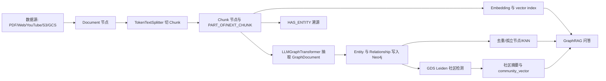

# 文档到知识图谱流水线

```mermaid
flowchart LR
  A[数据源: PDF/Web/YouTube/S3/GCS] --> B[Document 节点]
  B --> C[TokenTextSplitter 切 Chunk]
  C --> D[Chunk 节点与 PART_OF/NEXT_CHUNK]
  D --> E[Embedding 与 vector index]
  D --> F[LLMGraphTransformer 抽取 GraphDocument]
  F --> G[Entity 与 Relationship 写入 Neo4j]
  D --> H[HAS_ENTITY 溯源]
  G --> I[去重/孤立节点/KNN]
  G --> J[GDS Leiden 社区检测]
  J --> K[社区摘要与 community_vector]
  E --> L[GraphRAG 问答]
  I --> L
  K --> L
```
