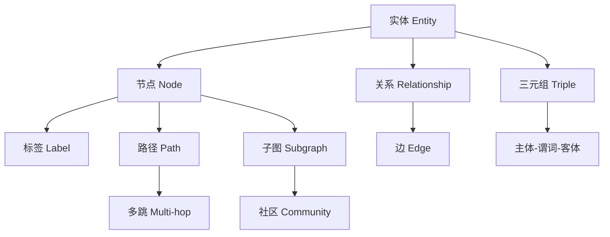

# 02 知识图谱基础术语与多跳推理

## 引言

学习知识图谱时，最容易卡住的不是某个工具，而是一堆看起来很像、实际含义不同的术语。比如“实体”和“节点”是不是一回事？“关系”和“边”有什么区别？“多跳”到底跳的是什么？这一课专门把基础词汇讲清楚。

可以把知识图谱想象成一张“带语义的关系地图”。普通地图告诉你城市之间有没有路；知识图谱不仅告诉你有路，还告诉你这条路是什么关系、从哪份资料来、可信度多少、能不能被查询和推理。



## 实体、节点、标签

**实体**是现实世界或业务世界里可以被明确指认的对象。例如“Neo4j”“LangChain”“某篇论文”“某个客户”。

**节点**是实体在图数据库里的载体。一个实体进入 Neo4j 后，通常会变成一个 node。

**标签**是节点的类型。例如：

```cypher
(:Company {id: "Neo4j"})
(:Library {id: "LangChain"})
(:Document {fileName: "demo.pdf"})
```

生活化理解：实体是“人”，节点是“身份证档案”，标签是“学生/员工/客户”这类身份。

## 关系、边、方向

**关系**是两个实体之间的语义连接。**边**是关系在图数据库中的结构表达。

关系通常有方向：

```text
(LangChain)-[:CALLS]->(LLMGraphTransformer)
```

这句话表示 LangChain 调用了 LLMGraphTransformer。反过来写，语义就变了。知识图谱里关系方向非常重要，尤其是因果、包含、雇佣、投资、引用、调用这些关系。

## 三元组

三元组是知识图谱的最小事实单位：

```text
主体 - 谓词 - 客体
subject - predicate - object
```

例如：

```text
知识图谱平台 - USES - Neo4j
Chunk - HAS_ENTITY - Entity
Document - FIRST_CHUNK - Chunk
```

如果把知识图谱比作一本书，三元组就是一句句事实短句。

## 属性图、RDF、本体、Schema

**属性图**允许节点和关系都带属性。Neo4j 属于属性图体系，适合工程查询和路径遍历。

**RDF**强调用标准三元组表达知识，适合跨系统交换。

**OWL**和**本体**强调概念定义、关系约束和推理。比如“公司是组织的一种”“收购关系只能发生在组织之间”。

**Schema**是工程里的结构约定。它不一定像 OWL 那么严格，但至少要规定有哪些节点类型、关系类型、属性和方向。

## 专有名词速查表

| 名词 | 专业解释 | 通俗理解 | 常见坑 |
|---|---|---|---|
| Entity 实体 | 现实或业务世界中可被唯一指认的对象 | “张三”“Neo4j”“某合同” | 同名不一定同实体，例如两个叫张三的人 |
| Mention 指称 | 文本中提到实体的一段原文 | 文档里出现的“苹果”两个字 | 指称需要链接到具体实体：水果还是公司 |
| Node 节点 | 图数据库中承载实体或概念的结构 | 档案卡片 | 节点不一定都是实体，也可能是文档、分块、社区 |
| Label 标签 | 节点类型 | “公司”“人物”“产品” | 标签太多会导致 schema 漂移 |
| Relationship 关系 | 两个实体之间的语义连接 | “任职于”“收购”“引用” | 关系方向错了，语义就可能反了 |
| Edge 边 | 图结构里的连接线 | 地图上的路 | 边可以表示事实，也可以表示相似、顺序、溯源 |
| Property 属性 | 节点或关系上的字段 | 公司成立时间、关系置信度 | 属性不要替代重要关系，否则无法多跳查询 |
| Triple 三元组 | 主体、谓词、客体构成的事实 | 一句结构化短句 | 三元组不是越多越好，质量和来源更重要 |
| Ontology 本体 | 对概念、层级、关系、约束的正式定义 | 一套业务词典和规则 | 本体过重会拖慢落地，过轻又无法治理 |
| Schema | 工程中的图谱结构约定 | 数据库表结构的图谱版本 | 不控制 schema，LLM 会创造大量近义类型 |
| Path 路径 | 多个节点和关系组成的链 | 从 A 顺着关系走到 B 的路线 | 路径越长，噪声和成本越高 |
| Hop 跳 | 沿一条关系走一次 | 走一步 | 多跳不是“多查几次”，而是沿关系链推理 |
| Subgraph 子图 | 从大图中取出的一部分 | 只看某个客户周围的关系网 | 子图太大时会把无关上下文塞给模型 |
| Community 社区 | 连接紧密的一组节点 | 一个主题圈子 | 社区摘要需要随数据变化更新 |
| Embedding 向量 | 把文本或实体表示成数字向量 | 语义坐标 | 相似不等于相同，不能直接当事实 |
| Vector Index 向量索引 | 用于快速找相似向量的索引 | 快速找“意思相近”的内容 | 维度必须和 embedding 模型一致 |
| Fulltext Index 全文索引 | 用关键词匹配文本的索引 | 搜文件名、编号、专有名词 | 只靠全文难处理同义表达 |
| Hybrid Retrieval 混合检索 | 组合向量、全文、图查询 | 既按意思找，也按关键词和关系找 | 需要路由和重排，否则上下文会很乱 |
| Provenance 溯源 | 事实来自哪里、由谁生成、何时生成 | 每条事实的出处小票 | 没有溯源，企业问答很难被信任 |
| Entity Resolution 实体解析 | 判断多个名称是否指向同一实体 | 合并“OpenAI”和“OpenAI Inc.” | 误合并比漏合并更危险 |
| Centrality 中心性 | 衡量节点在图中的重要程度 | 谁是关系网里的关键人物 | 高连接节点可能只是泛化词 |
| PageRank | 一种根据连接关系计算重要性的算法 | 被重要节点指向也会更重要 | 不适合所有业务语义 |
| WCC 弱连通分量 | 忽略方向后能连在一起的一组节点 | 不管路朝哪边，能走到就算一组 | 只能看连通，不代表主题一致 |
| Leiden/Louvain | 常见社区检测算法 | 自动找主题圈子 | 结果依赖图结构和参数 |
| Cypher | Neo4j 的图查询语言 | 图数据库里的 SQL | 写多跳查询时要限制路径长度 |
| SPARQL | RDF 图的标准查询语言 | 语义网里的查询语言 | 和 Cypher 面向的图模型不同 |
| SHACL | RDF 数据质量约束语言 | 规则检查器 | 适合标准语义图，不等于所有图数据库都原生使用 |

## 路径与多跳

**路径**是一串节点和关系。例如：

```text
用户问题 -> Chunk -> Entity -> RelatedEntity -> SourceDocument
```

**跳**指从一个节点沿一条关系走到另一个节点。走一次叫一跳，走两次叫两跳。

例子：

```text
(Alice)-[:WORKS_AT]->(Neo4j)
```

Alice 到 Neo4j 是 1 跳。

```text
(Alice)-[:WORKS_AT]->(Neo4j)-[:DEVELOPS]->(GraphRAGPackage)
```

Alice 到 GraphRAGPackage 是 2 跳。

多跳问题就是答案不在单个实体上，而在一条关系链上。比如“Alice 参与的公司开发了什么 GraphRAG 工具？”需要先找到 Alice 的公司，再找公司开发的工具。

多跳最重要的不是“跳得越多越聪明”，而是“每一跳都必须有业务意义”。例如：

| 问题 | 需要几跳 | 推理链 |
|---|---:|---|
| Alice 在哪家公司工作？ | 1 跳 | Alice -> WORKS_AT -> 公司 |
| Alice 所在公司开发了什么产品？ | 2 跳 | Alice -> 公司 -> 产品 |
| Alice 所在公司开发的产品依赖什么数据库？ | 3 跳 | Alice -> 公司 -> 产品 -> 数据库 |

企业系统通常把多跳限制在 2-4 跳，因为跳数越高，候选路径越多，噪声、延迟和权限风险都会上升。

## 邻居、子图、社区

**邻居**是和某个节点直接相连的节点。1 跳邻居最直接，2 跳邻居更宽。

**子图**是从大图里取出的一小块。GraphRAG 经常先找到相关实体，再取它周围的子图作为上下文。

**社区**是一组连接紧密的实体。比如一批论文中，某些作者、方法、数据集经常互相连接，就可能形成一个研究主题社区。

## 向量索引、全文索引、图索引

**向量索引**用于找语义相似。例如用户问“图谱如何帮助检索”，可以找到表达相近的 chunk。

**全文索引**用于找关键词精确命中。例如文件名、编号、专有名词。

**图结构查询**用于找关系链。例如两个实体之间是否通过某些路径相连。

成熟 GraphRAG 通常三者结合，而不是只靠一种检索。

## 小结

知识图谱基础术语可以归纳为三层：

- 表达层：实体、关系、三元组、属性、标签。
- 结构层：路径、多跳、邻居、子图、社区。
- 工程层：schema、索引、约束、溯源、更新、删除。

理解这些词，后面学习 Neo4j、Cypher、GraphRAG 和 Agent 才不会只是在记工具名。
