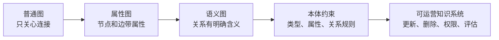

# 03 从各种图到知识图谱

## 引言

不是所有图都是知识图谱。地铁线路图、社交网络图、依赖关系图、KNN 相似图都可以叫图，但它们不一定表达“知识”。知识图谱的特别之处在于：节点和边有明确语义，能够承载事实、概念、属性、来源和约束。

## 图的几个层级

**普通图**只关心点和边。例如 A 连着 B，B 连着 C。它适合讲连通性、路径、中心性。

**属性图**给节点和边增加 label 与 properties。Neo4j 使用的就是属性图模型，例如：

```text
(:Person {id: "Alice"})-[:WORKS_AT {since: 2024}]->(:Company {id: "Neo4j"})
```

**语义图**进一步要求关系具有明确语义，常见表达是 RDF 三元组：主体、谓词、客体。

**异构图**允许多种节点类型和关系类型共存，比如 `Document`、`Chunk`、`Entity`、`__Community__` 同时存在。

**知识图谱**通常综合以上能力：它既要表达事实，也要支持查询、推理、检索、可视化和持续维护。

## 一个生活化对照

| 类型 | 类比 | 它主要回答什么 |
|---|---|---|
| 普通图 | 地铁线路图 | 哪些站连着，怎么换乘 |
| 属性图 | 公司组织架构图，每个人还有职位、部门、入职时间 | 谁属于哪个部门，每个人有什么属性 |
| 语义图 | 合同条款关系图 | 谁对谁有什么义务，关系含义是什么 |
| RDF 图 | 标准化事实卡片 | 不同系统能否用同一种格式交换事实 |
| 知识图谱 | 企业知识地图 | 一个客户、订单、产品、工单、人员之间到底如何关联 |

如果只是想知道“北京站到上海站怎么走”，普通图就够了。如果想回答“某客户投诉的产品由哪个团队维护、最近改过哪些代码、历史上是否出过类似故障”，就需要知识图谱。

## 从图到知识图谱的迭代

可以把迭代路径理解为：

```text
点边结构 -> 属性图 -> 语义关系 -> 本体约束 -> 可运营知识系统
```

前几步解决“怎么表示”，最后一步解决“怎么在工程中长期使用”。很多团队失败，不是因为画不出节点和边，而是没有处理好版本、去重、溯源、权限、索引和查询性能。

## 工程系统中的常见图模型

一个面向问答和治理的知识图谱平台，通常会采用混合模型：

- `Document` 表示数据源。
- `Chunk` 表示可检索文本片段。
- LLM 抽取出的实体带有业务 label。
- `HAS_ENTITY` 把 chunk 和实体连接起来，用于溯源。
- `SIMILAR` 表示 chunk 之间的向量相似。
- `__Community__` 表示图算法发现的实体社区。

这不是单一“知识图谱”，而是一套为 GraphRAG 服务的图谱系统。



## 小结

学习知识图谱时，要先区分“图结构”和“知识结构”。图结构回答连接问题，知识结构回答语义问题，工程系统还要回答更新、检索、治理和评估问题。
