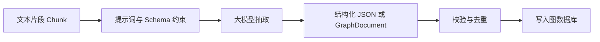

# 06 大模型如何帮助抽取知识

## 引言

大模型擅长把自然语言转成结构化表达。知识图谱构建中，它最常见的角色是：阅读一个 chunk，然后输出节点、关系和属性。

## LLM 抽取的基本协议

一个可靠协议通常包含：

- 允许的节点类型：例如 `Person, Company, Product, Concept`。
- 允许的关系类型：例如 `(Company, ACQUIRED, Company)`。
- 输出格式：JSON、函数调用、Pydantic schema 或 LangChain GraphDocument。
- 额外规则：不要编造，关系必须来自文本，实体 id 要规范化。
- 溯源：每个实体和关系最好能关联到 chunk。

成熟工程常使用图转换器或结构化输出组件，并把 `allowed_nodes`、`allowed_relationships`、`node_properties`、`relationship_properties`、`additional_instructions` 传给模型。这是工程上非常关键的一步：让模型在可控空间里抽取，而不是自由发挥。

本节配套代码覆盖三段完整链路：

- `llm_extraction_prompt.py`：不用真实模型，先理解 schema 约束如何进入提示词。
- `validate_graph_output.py` 与 `schema_driven_extraction_pipeline.py`：校验、规范化、去重并过滤坏关系。
- `langchain_graph_transformer_demo.py` 与 `write_graph_documents_to_neo4j.py`：用 LangChain 生成 `GraphDocument`，再把节点、关系和 chunk 溯源写入 Neo4j。

## LLM 抽取的优势

LLM 不需要为每个领域训练专门模型。只要给出 schema 和示例，它就能从合同、论文、网页、视频字幕中抽取结构化知识。对冷启动项目非常有价值。

## LLM 抽取的风险

LLM 的问题也很明显：

- 同一个实体可能写成多个 id。
- 关系名称可能漂移。
- 模型可能补全原文没有的信息。
- 长文档被切 chunk 后，跨 chunk 关系会丢失。
- 输出格式偶尔不稳定。

所以 LLM 抽取后必须有后处理：去重、schema consolidation、孤立节点清理、社区检测、人工可视化检查。

代码案例里特别强调两个生产约束：

- 模型输出不能直接写库。必须先检查节点类型、关系签名、实体 id 是否为空、关系两端节点是否存在。
- 关系类型和 label 不能任意来自模型。要么使用固定 Cypher 模板，要么使用白名单后再调用 APOC 或 GraphStore。

## 坏输出和好输出

没有 schema 约束时，模型可能输出：

```text
知识图谱构建器 - IS_RELATED_TO - LangChain
知识图谱构建器 - PUTS_DATA_SOMEWHERE - Neo4j
```

这些关系看起来能懂，但工程上很难维护。下次模型可能又写成 `USES_TOOL`、`WRITES_INTO`。

加上 schema 后，希望输出变成：

```text
知识图谱构建器 - USES - LangChain
知识图谱构建器 - STORES_IN - Neo4j
```

这就是为什么生产系统要支持 `allowedNodes` 和 `allowedRelationship` 这类白名单约束。



## 小结

LLM 不是知识图谱的终点，而是知识图谱流水线里的抽取器。真正的系统能力来自“LLM 抽取 + 图数据库 + schema 约束 + 后处理 + 检索评估”。

完成本节后，建议能回答三个工程问题：

- 一个 chunk 的抽取结果如何保留来源，方便后续 GraphRAG 引用？
- `LLMGraphTransformer` 产物为什么还需要二次校验？
- 为什么实体 id 规范化会影响后续去重、社区检测和问答稳定性？
