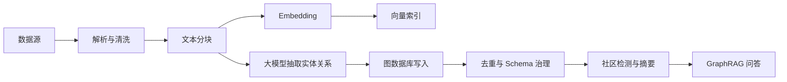

# 09 工程流水线：从文档到知识图谱

## 引言

真实知识图谱构建不是“上传文件 -> 得到图”。它是一条长任务流水线，包含数据源读取、分块、embedding、LLM 抽取、写库、状态更新、重试和后处理。

## 企业级流水线

一条完整的文档到知识图谱流水线，可以概括为：

1. 前端选择数据源和模型。
2. 后端创建 `Document` 源节点。
3. 读取 PDF、网页、YouTube、Wikipedia、S3/GCS 文件。
4. `TokenTextSplitter` 生成 chunk。
5. 写入 `Chunk`，建立 `PART_OF`、`FIRST_CHUNK`、`NEXT_CHUNK`。
6. 为 chunk 生成 embedding，创建 `vector` 索引。
7. 调用 `LLMGraphTransformer` 抽取实体和关系。
8. 保存 `GraphDocument` 到 Neo4j。
9. 建立 `Chunk-[:HAS_ENTITY]->Entity`。
10. 更新 `Document` 状态、统计、token usage 和处理耗时。

## 工程阅读任务

阅读任何同类系统时，建议重点观察这些设计：

- 入口任务：如何把上传文件、网页、对象存储、数据库记录统一成 `Document`。
- 分块任务：如何控制 chunk 大小、重叠、顺序和来源位置。
- 抽取任务：如何把 schema 约束传给模型，并保存结构化结果。
- 写库任务：如何保证幂等、批量写入、失败重试和状态回写。
- 后处理任务：如何更新索引、去重、社区摘要和评估指标。

阅读任务：

1. 找出 `Document` 状态从 `New` 到 `Processing` 再到 `Completed` 的转换规则。
2. 找出 `Chunk-[:HAS_ENTITY]->Entity` 是在哪一步建立的。
3. 找出 token usage、处理耗时、失败原因是如何回写到任务记录的。

## 状态机很重要

长任务一定会失败：模型超时、文件太大、网络中断、用户取消、token 超限、Neo4j 连接断开。生产系统通常用 `Document.status`、`processed_chunk`、`retry_condition` 记录进度，并支持从上次 chunk 继续。

这给课程一个重要经验：知识图谱构建要按“作业系统”设计，而不是按“函数调用”设计。

## Chunk 和 Entity 的双层结构

为什么不直接把文档抽成实体？因为问答需要原文证据。`Chunk` 保存文本和位置，`Entity` 保存结构化知识，`HAS_ENTITY` 把两者连起来。这样回答时既能拿实体关系，也能返回来源 chunk。

## 小结

工程上，知识图谱是一条可观测、可恢复、可治理的数据管道。把它做成稳定系统，比单次抽取更重要。
