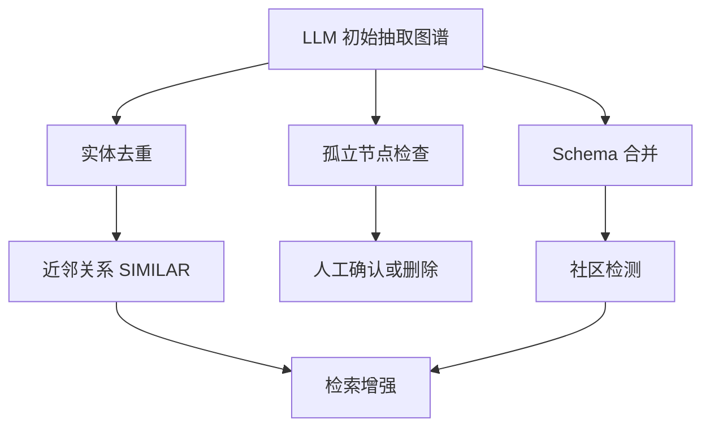

# 10 后处理：近邻、去重、孤立节点与社区检测

## 引言

知识图谱建立后，真正的工程工作才刚开始。LLM 抽取出的图通常会有重复实体、孤立节点、关系命名漂移、schema 不一致和检索索引缺失。

## KNN 与 SIMILAR

生产系统会查询 Neo4j vector index 或其他向量索引，把 embedding 相近的 chunk 用 `SIMILAR` 关系连接起来。这样检索到一个 chunk 后，可以扩展到语义相近的其他 chunk。

通俗地说，KNN 就像“帮一篇文章找最像它的几篇文章”。它不是说两篇文章有事实关系，而是说它们语义上接近。知识图谱里要把这种相似边和事实边分开。

KNN 关系不是原文事实，而是后处理生成的相似性边。课程里要明确区分：

- 知识关系：`Company ACQUIRED Company`
- 溯源关系：`Chunk HAS_ENTITY Entity`
- 结构关系：`Chunk NEXT_CHUNK Chunk`
- 相似关系：`Chunk SIMILAR Chunk`

## 去重

LLM 可能抽出 `OpenAI`、`Open AI`、`OpenAI Inc.`。成熟做法会结合字符串包含、编辑距离、embedding cosine、label 一致性和外部主数据编号找重复，再用合并策略写回图数据库。

实体去重必须谨慎。相似不等于相同，尤其在人名、缩写、产品版本里。

## 孤立节点

孤立节点是没有领域关系的实体。它可能是噪声，也可能是重要但暂时没连上的实体。工程上一般先列出给用户确认，再删除。

## 社区检测

生产系统常用 GDS Leiden、Louvain 或 Weakly Connected Components 等算法做社区检测，把实体划分到 `__Community__`，再生成 `IN_COMMUNITY` 和 `PARENT_COMMUNITY`。随后用 LLM 给社区生成摘要，并为社区摘要建立向量和全文索引。

社区可以理解成朋友圈或部门小团体：有些实体彼此联系特别密集，就很可能围绕同一个主题。比如“GraphRAG、Chunk、Entity、Community、Neo4jVector”经常连在一起，它们可能组成“图谱增强检索”社区。

这一步直接服务 GraphRAG 的全局搜索：用户问“这批文档整体讲了哪些主题”时，社区摘要比单个 chunk 更合适。

## 代码案例：去重候选与人工确认

后处理课的代码案例不应该追求“一键自动合并”，而要展示风险控制。下面的查询只生成候选，不直接改图。

```cypher
MATCH (a:Entity), (b:Entity)
WHERE a.id < b.id
  AND a.type = b.type
  AND toLower(a.name) CONTAINS toLower(b.name)
RETURN a.id AS left_id, b.id AS right_id, a.name AS left_name, b.name AS right_name
LIMIT 50;
```

确认后再合并，并把来源和时间写入审计日志：

```cypher
MATCH (keep:Entity {id: $keepId}), (drop:Entity {id: $dropId})
MERGE (audit:MergeAudit {id: randomUUID()})
SET audit.createdAt = datetime(), audit.reason = $reason
MERGE (audit)-[:KEPT]->(keep)
MERGE (audit)-[:DROPPED]->(drop);
```

## 小结

后处理决定知识图谱能否从 demo 走向生产。一个好图谱不是抽取得到的，而是抽取、清洗、合并、索引、评估和治理共同得到的。



## 工程阅读任务

阅读后处理模块时，重点检查：

- KNN 是否只表示语义相似，而不是事实关系。
- 去重是否有置信度、人工确认和回滚策略。
- 孤立节点是否先展示给用户确认，而不是直接删除。
- 社区摘要是否有版本号，是否能随增量更新局部重算。

阅读问题：

- 哪些后处理可以自动执行，哪些应该先让人确认？
- 近邻关系 `SIMILAR` 是事实关系吗？
- 社区摘要过期后，应该全量重算还是局部重算？
