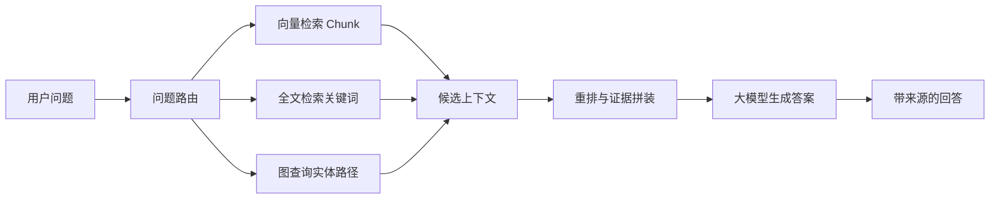

# 11 图谱增强检索与问答

## 引言

普通 RAG 常做一件事：把问题转成向量，找相似 chunk，再交给 LLM 回答。GraphRAG 增加了结构化知识，让检索不仅能“找相似文本”，还能“沿关系扩展上下文”。

## GraphRAG 的核心思想

GraphRAG 不是单一算法，而是一组模式：

- 从 chunk 检索开始，再扩展到实体和关系。
- 从实体检索开始，再找邻居、相关 chunk 和社区。
- 用全文检索补足向量检索的关键词精确匹配。
- 用社区检测和社区摘要回答全局问题。
- 用 Cypher 直接查询结构化事实。

Microsoft 的 GraphRAG 论文强调 local-to-global：先从文档抽实体图，再对社区生成摘要，用于回答需要综合整个语料的问题。

## 常见问答模式

一个完整的 GraphRAG 系统通常会支持：

- `vector`：只用 chunk 向量。
- `fulltext`：向量 + chunk 全文索引。
- `graph_vector`：chunk 向量 + 图邻域扩展。
- `graph_vector_fulltext`：混合向量、全文和图扩展。
- `entity_vector`：从实体向量进入局部社区。
- `global_vector`：从社区摘要向量进入全局检索。
- `graph`：使用 GraphCypherQAChain 让 LLM 生成 Cypher 查询。

这非常适合教学：同一个问题可以在不同模式下比较答案、来源和稳定性。

## 一条完整问答链路

用户问：

```text
为什么知识图谱平台能支持 GraphRAG？
```

普通向量 RAG 可能只找到一段提到 “GraphRAG” 的文本。GraphRAG 会多做几步：

1. 用向量索引找到相关 `Chunk`。
2. 沿 `HAS_ENTITY` 找到 `GraphRAG`、`Neo4j`、`LangChain` 等实体。
3. 沿实体关系找邻居，例如 `GraphRAG - USES - Neo4j`。
4. 如果问题很全局，再查 `__Community__` 摘要。
5. 把 chunk 文本、实体关系、来源文档一起交给 LLM。

所以 GraphRAG 的答案更容易带证据链，而不是只凭一个相似片段回答。

## 什么时候需要 GraphRAG

GraphRAG 适合：

- 多跳问题。
- 实体中心问题。
- 需要证据链的问题。
- 需要全局总结的问题。
- 需要把非结构化文本和结构化业务数据连接的问题。

如果只是简单 FAQ，普通向量 RAG 可能更便宜。

## 小结

GraphRAG 的价值不是“更酷”，而是把检索从相似文本提升到结构化上下文。它能让 LLM 回答更可追踪、更适合多跳推理，但也带来更高的数据建模和维护成本。



## 工程阅读任务

阅读 GraphRAG 问答系统时，建议检查：

- 是否有 query router，把问题分到向量、全文、图查询、全局摘要或混合模式。
- 是否保留 chunk、entity、community 的来源，用于引用和审计。
- 是否限制多跳扩展范围，避免路径爆炸。
- 是否记录每种检索模式的命中率、延迟、token 成本和用户反馈。

阅读问题：

- 哪些问题适合向量检索，哪些适合查询语言？
- 为什么全局总结需要社区摘要？
- 回答中如何保留 chunk、entity、community 的来源信息？
