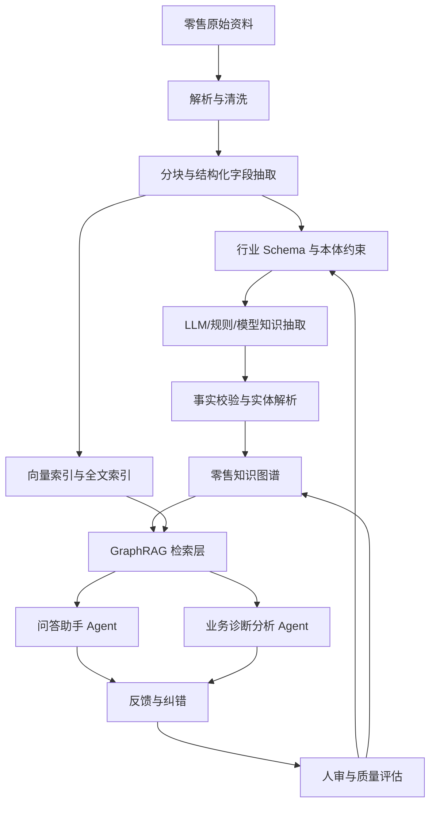
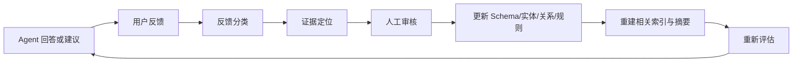

# 13 企业实践：用知识图谱搭建零售行业知识中台

## 引言

这一课讨论一个更贴近企业真实需求的问题：如果我们有一套系统，专门从零售行业的原始资料中抽取通用知识，然后把这些知识提供给问答助手 Agent、业务诊断分析 Agent、运营决策 Agent 使用，这套系统应该怎么设计？

答案不是“直接把所有内容丢进 Neo4j”。更准确地说，知识图谱可以成为知识中台的**核心语义层和关系层**，但它需要和原始文档库、结构化数据库、向量索引、全文索引、任务系统、反馈系统、人审系统一起工作。

可以先给一个结论：

- 零售行业的通用知识可以存入知识图谱，但不要只存知识图谱。
- 原始资料要保留，方便追溯、重新抽取和审计。
- 文本片段要保留，方便 RAG 引用原文证据。
- 稳定事实、行业概念、业务规则、实体关系适合沉淀进知识图谱。
- Agent 使用后的反馈不应直接改图谱，而要进入“反馈待审核层”，经过校验后再更新知识中台。

## 什么是知识中台

知识中台不是一个单独数据库，而是一套把企业知识持续沉淀、治理、检索、分发和迭代的系统。

在零售行业里，它要把这些来源统一起来：

- 商品资料：SKU、SPU、品类、品牌、规格、价格、卖点、替代品。
- 门店资料：区域、商圈、面积、客流、陈列、库存、人员。
- 交易资料：订单、购物篮、会员、促销、退货、支付。
- 供应链资料：供应商、采购、仓库、运输、补货、缺货。
- 运营资料：活动方案、促销规则、陈列规范、会员政策。
- 分析资料：销售日报、异常诊断报告、竞品分析、市场趋势。
- 交互资料：业务人员提问、Agent 回答、用户纠错、人工审核结果。

这些资料原本散落在 ERP、POS、CRM、WMS、OMS、BI、文档系统和聊天记录里。知识中台的价值，是把它们变成一套可复用、可追踪、可更新的“行业知识底座”。

## 为什么知识图谱适合做知识中台的核心

零售行业的知识天然是关系型的：

```text
商品 属于 品类
商品 由 供应商 供货
门店 位于 商圈
促销活动 影响 商品销量
缺货 影响 门店销售
会员 偏好 品类
竞品 替代 商品
```

这些问题很难只靠向量检索回答：

- “某门店饮料销量下降，可能和哪些库存、促销、天气、竞品因素有关？”
- “这个新品适合在哪些门店先试点？”
- “如果供应商 A 延迟交付，会影响哪些城市、门店和促销活动？”
- “某个品类毛利下降，关联到哪些商品、供应商、折扣策略和退货原因？”

这类问题都需要沿着实体和关系做多跳分析。知识图谱正好擅长表达“谁和谁有关、经过什么关系、证据来自哪里”。

## 知识中台的整体架构



这个架构里，知识图谱不是孤岛，而是知识中台的中心语义结构。它负责连接概念、实体、规则、来源、时间和业务指标。

## 零售行业知识该怎么存

知识中台至少需要五层存储。

| 层级 | 存什么 | 是否适合知识图谱 | 原因 |
|---|---|---|---|
| 原始资料层 | PDF、Excel、网页、报告、聊天记录 | 不直接作为图谱主体 | 需要保留原文，方便审计和重抽取 |
| Chunk 层 | 可检索文本片段、页码、段落、来源 | 适合部分入图 | 用于溯源和 GraphRAG 引用 |
| 实体事实层 | 商品、门店、品类、供应商、活动、指标 | 适合入图 | 这是多跳查询和业务分析的核心 |
| 规则知识层 | 补货规则、促销规则、陈列规范、异常判断逻辑 | 适合入图，但要版本化 | 规则会变化，必须保留时间和版本 |
| 反馈学习层 | 用户纠错、Agent 失败案例、人工审核结果 | 适合先入反馈队列，再入图 | 避免错误反馈直接污染主图谱 |

通俗地说：原始资料是“仓库”，chunk 是“证据卡片”，知识图谱是“关系地图”，反馈系统是“改错本”，人审系统是“质检台”。

## 一个零售知识图谱 Schema 示例

```text
(:Product {sku, name, brand, categoryId})
(:Category {id, name, level})
(:Store {id, name, city, district, businessCircle})
(:Supplier {id, name, riskLevel})
(:Promotion {id, name, startDate, endDate})
(:InventoryEvent {id, date, quantity, eventType})
(:SalesMetric {id, date, salesAmount, grossMargin, conversionRate})
(:BusinessRule {id, name, version, validFrom, validTo})
(:Document {id, sourceType, title, updatedAt})
(:Chunk {id, text, position})
(:Feedback {id, userId, agentName, feedbackType, status})
```

常见关系：

```text
(Product)-[:BELONGS_TO]->(Category)
(Product)-[:SUPPLIED_BY]->(Supplier)
(Store)-[:LOCATED_IN]->(BusinessCircle)
(Promotion)-[:APPLIES_TO]->(Product)
(InventoryEvent)-[:AFFECTS]->(Product)
(SalesMetric)-[:MEASURED_FOR]->(Product)
(SalesMetric)-[:MEASURED_AT]->(Store)
(BusinessRule)-[:CONSTRAINS]->(Promotion)
(Chunk)-[:MENTIONS]->(Product)
(Chunk)-[:SUPPORTS_FACT]->(BusinessRule)
(Feedback)-[:TARGETS]->(AgentAnswer)
```

这里有一个重要原则：不要只建“名词图谱”，还要建“业务问题图谱”。零售知识中台真正要服务的不是展示节点，而是回答诊断问题、推荐行动和解释原因。

## 知识抽取如何做

零售资料既有结构化数据，也有非结构化文本。成熟做法通常不是只用 LLM，而是多种方法组合：

| 来源 | 抽取方法 | 例子 | 风险 |
|---|---|---|---|
| 商品主数据 | 规则、ETL、主键映射 | SKU、品牌、品类 | 字段口径不统一 |
| 销售与库存数据 | SQL/指标层同步 | 销量、库存、毛利 | 指标口径变化 |
| 运营文档 | LLM + schema 约束 | 促销规则、陈列规范 | LLM 编造或关系漂移 |
| 分析报告 | LLM + 人审 | 异常原因、建议动作 | 把分析结论误当事实 |
| 用户反馈 | 分类模型 + 审核流 | “这个回答引用了过期规则” | 恶意或低质量反馈 |

LLM 适合抽取文本中的规则、因果、异常解释和业务建议；结构化系统里的强事实，应该优先用 ETL 或 API 同步，不要让 LLM 重新猜。

## 知识沉淀不是一次性任务

知识中台最复杂的地方，是它要持续迭代。

零售行业每天都会发生变化：

- 商品上下架。
- 价格调整。
- 促销活动开始或结束。
- 门店库存变化。
- 供应商风险变化。
- 会员行为变化。
- 业务人员发现 Agent 回答不准确。

所以知识中台必须有增量机制：

1. 用稳定主键识别实体，例如 SKU、门店编号、供应商编号。
2. 用内容哈希识别文档和 chunk 是否变化。
3. 只重抽受影响的 chunk、实体、关系和规则。
4. 对时效性事实保留 `validFrom`、`validTo`。
5. 对高风险更新进入人审，不直接覆盖主图谱。
6. 更新后触发相关索引、社区摘要和评估集重算。

## Agent 如何使用知识中台

问答助手 Agent 和业务诊断分析 Agent 使用知识中台的方式不同。

**问答助手 Agent**更关注准确回答：

```text
用户问：某类促销活动的适用条件是什么？
检索层：找到促销规则 chunk、对应 BusinessRule、关联品类和有效时间。
回答层：生成答案，并附上规则来源和生效日期。
```

**诊断分析 Agent**更关注原因链路：

```text
用户问：华东区门店 A 本周乳制品销量为什么下降？
检索层：
1. 查 Store -> SalesMetric，确认销量下降。
2. 查 Product -> InventoryEvent，发现核心 SKU 缺货。
3. 查 Promotion，发现竞品促销活动同期开始。
4. 查 Supplier，发现补货延迟。
回答层：给出可能原因排序、证据路径和建议动作。
```

这就是知识图谱的价值：Agent 不只是“搜到几段话”，而是能沿着业务对象做多跳追踪。

## 反馈如何回流

Agent 用了知识中台以后，反馈必须回流，否则系统不会越用越好。

反馈分三类：

| 反馈类型 | 例子 | 处理方式 |
|---|---|---|
| 答案反馈 | 用户点踩：“这个促销规则已经过期” | 进入 AnswerFeedback，关联被引用规则和 chunk |
| 知识反馈 | 业务人员纠正：“这个商品属于新分类” | 进入 KnowledgeChangeRequest，等待审核 |
| 行动反馈 | Agent 建议调货，实际执行后效果不好 | 进入 ActionOutcome，反哺诊断规则和推荐策略 |

不要让反馈直接写入主图谱。成熟系统会设计一个反馈闭环：



这里最关键的是“证据定位”：反馈不能只说“错了”，而要定位到哪个实体、关系、规则、chunk 或检索策略错了。

## 外部成熟做法带来的启发

从企业级知识图谱、语义层、Agent 知识层产品可以看到几个共同方向：

- Stardog 强调 Enterprise Knowledge Graph、语义层和虚拟图，重点是跨数据孤岛统一语义，而不是把所有数据搬进一个库。
- HASH 强调持续更新的 world model、权限、历史版本、来源和双向同步，适合理解“知识中台不是静态库”。
- Oiya 强调给多 Agent 提供共享、结构化、自更新、有人审的知识层，说明 Agent 时代需要统一上下文。
- RAG Engine、ZGI 等平台把文档 ETL、向量库、知识图谱、多路召回和 Agent 编排放在一起，说明生产系统通常是混合检索，而不是单一 GraphRAG。
- Neo4j 在零售推荐、Customer 360、供应链和物流场景里强调图关系和图算法，说明零售行业确实有大量“关系驱动”的业务问题。

这些做法可以总结成一句话：成熟知识中台不是“图数据库产品”，而是“语义建模 + 数据接入 + 图谱存储 + 混合检索 + Agent 编排 + 反馈治理”的组合。

## 设计零售知识中台的关键难点

**第一，通用知识和企业私有知识要分层。**
零售行业通用知识包括品类、促销、库存、补货、会员、陈列、供应链等概念；企业私有知识包括自己的门店、商品、供应商、活动和指标口径。两者不能混在一起，否则后续复用和迁移会很痛苦。

**第二，规则必须版本化。**
促销规则、补货规则、会员规则都有生效期。Agent 回答时必须知道“当前有效规则”和“历史规则”。

**第三，指标口径要入图。**
“销售额”“毛利率”“库存周转”不是简单数字，它们背后有计算口径、数据来源和适用范围。诊断 Agent 如果不理解指标口径，就会给出看似合理但实际错误的分析。

**第四，反馈要可审计。**
业务人员的反馈很宝贵，但也可能互相冲突。系统要记录谁反馈、基于什么证据、谁审核、改了哪些图谱事实。

**第五，Agent 权限要在检索前控制。**
区域经理不能看到全国所有门店的敏感经营数据，供应商也不能看到其他供应商数据。GraphRAG 不能先检索无权限内容再让模型“不要说”，必须在检索前过滤。

## 一份可落地的建设路线

| 阶段 | 目标 | 交付物 |
|---|---|---|
| 1. 领域建模 | 定义零售核心概念和关系 | 行业本体、Schema、指标口径表 |
| 2. 数据接入 | 接入商品、门店、销售、库存、文档 | 数据源清单、主键映射、权限映射 |
| 3. 初始图谱 | 建立 Product、Store、Supplier、Rule 等核心图谱 | Neo4j/RDF 图、向量索引、全文索引 |
| 4. Agent 接入 | 支持问答和诊断分析 | GraphRAG 检索器、Cypher 查询工具、答案引用 |
| 5. 反馈闭环 | 让用户纠错和行动结果回流 | Feedback 图谱、审核队列、质量评估 |
| 6. 持续治理 | 控制质量、成本、权限和版本 | 监控指标、评估集、变更日志、回滚机制 |

## 最终课程任务

请设计一个“零售行业知识中台”方案，至少回答这些问题：

1. 你的知识中台服务哪些 Agent？问答助手、诊断助手、推荐助手还是运营助手？
2. 哪些知识进入知识图谱，哪些只保留在原始资料或向量索引里？
3. 零售行业通用 Schema 如何设计？至少包含商品、门店、品类、供应商、促销、库存、销售指标、业务规则。
4. Agent 的反馈如何回流？哪些反馈可以自动处理，哪些必须人审？
5. 如何处理规则过期、商品改类、供应商变更、门店权限这些企业问题？
6. 如何评估这个知识中台是否真的有用？答案准确率、引用覆盖率、诊断命中率、反馈修复周期、业务人员采纳率都可以作为指标。

## 小结

零售行业通用知识可以保存在知识图谱中，但知识图谱不是全部。真正的知识中台是一套持续学习的企业知识系统：它从原始资料中抽取知识，把稳定事实和关系沉淀进图谱，用混合检索服务 Agent，再把 Agent 使用过程中的反馈、纠错和行动结果回流到治理流程中。

这件事复杂，正是因为它不只是技术问题。它同时涉及行业建模、数据治理、权限、评估、人审、业务闭环和组织流程。做得好，知识中台会成为零售 Agent 的共同大脑；做得不好，它只会变成另一个没人信任的资料库。

## 参考资料

- Stardog Enterprise Knowledge Graph 与 semantic layer：https://www.stardog.com/platform/
- Stardog Virtual Graphs：https://docs.stardog.com/virtual-graphs/
- HASH structured knowledge workspace：https://hash.ai/
- Oiya structured knowledge layer for AI agents：https://www.oiya.ai/
- Neo4j retail graph use cases：https://neo4j.com/videos/graphs-in-retail-know-your-customers-and-make-your-recommendation-engine-learn/
- Neo4j real-time recommendation graph use case：https://neo4j.com/use-cases/real-time-recommendation-engine/
