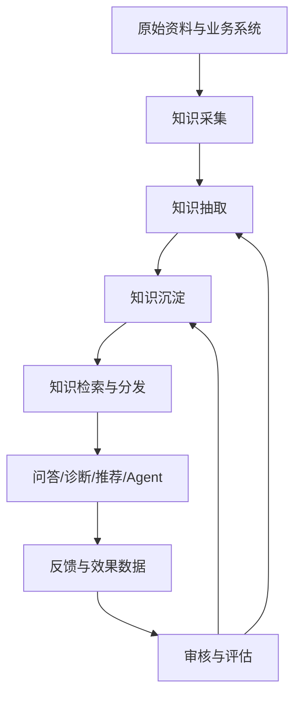
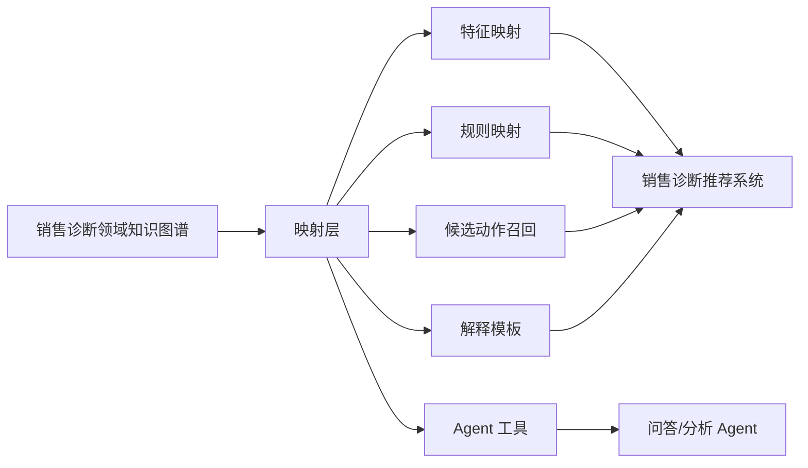
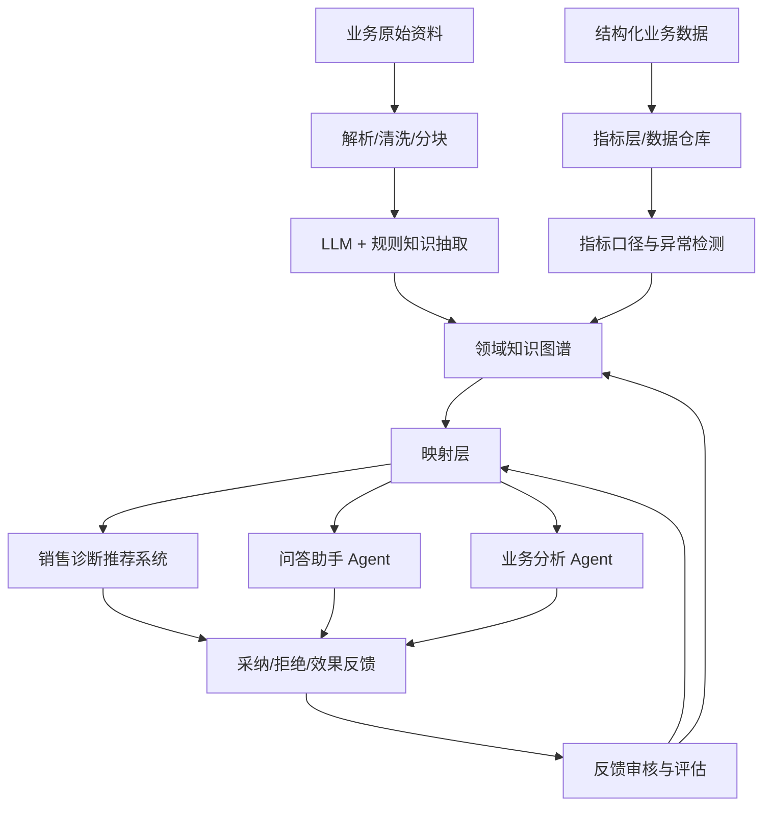
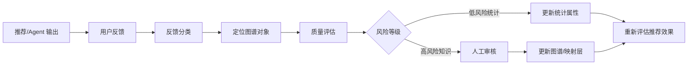

# 13 企业实践：用知识中台服务销售诊断推荐系统

## 引言

前面用零售行业举例，其实更通用的问题是：如果企业底层已经有一个“偏通用的销售诊断领域知识图谱”，再通过一个映射层，把这些知识提供给销售诊断推荐系统、问答助手 Agent、分析助手 Agent 使用，这算不算知识中台？应该怎么搭建？

这节课的核心观点是：

- 知识中台不是某一种数据库，也不必须使用知识图谱。
- 知识图谱可以成为知识中台的**语义关系层**，特别适合保存领域概念、业务对象、指标口径、因果链、诊断规则和可追溯证据。
- 知识中台还需要文档库、指标层、向量索引、全文索引、规则引擎、反馈系统、人审系统和权限治理。
- 面向推荐系统时，最好增加一个**映射层**，把通用领域知识转成推荐系统可用的特征、规则、约束、召回策略、解释模板和 Agent 工具。

也就是说，你现在描述的状态很接近外部倡导的企业知识中台或语义层：底层沉淀通用领域知识，上层通过统一接口服务不同业务系统。

## 什么是知识中台

知识中台可以理解为企业的“共享知识能力层”。它负责把散落在文档、数据库、业务系统、专家经验、Agent 交互中的知识沉淀下来，经过治理后提供给不同应用复用。

它通常包含六类能力：

| 能力 | 作用 | 常见载体 |
|---|---|---|
| 知识采集 | 从文档、系统、报表、对话中收集原始资料 | ETL、连接器、文档解析、API |
| 知识抽取 | 抽取实体、关系、规则、指标、原因、建议 | LLM、NLP、规则、人工标注 |
| 知识沉淀 | 保存可复用知识资产 | 文档库、知识图谱、指标字典、规则库 |
| 知识检索 | 给问答、推荐、诊断系统召回上下文 | 向量检索、全文检索、图查询、SQL |
| 知识治理 | 控制质量、版本、权限、来源和审核 | 本体、Schema、审计、数据血缘 |
| 知识反馈 | 把应用使用后的纠错和效果回流 | 反馈队列、人审、评估集、变更日志 |

因此，知识中台不是“把资料放进一个库”就结束了，它更像一个知识生命周期系统。



## 知识图谱能不能用于知识中台

可以，但要理解它适合放什么、不适合放什么。

知识图谱适合保存：

- 领域概念：客户、产品、渠道、销售机会、线索、保单、门店、代理人、活动。
- 指标口径：成交率、转化率、客单价、续保率、流失率、拜访频次。
- 因果与影响关系：库存不足影响转化，线索质量影响成交率，续保提醒影响保单留存。
- 诊断规则：某类指标异常时应该检查哪些对象、路径和证据。
- 业务约束：哪些建议不能推荐给某类客户，哪些区域不能使用某类策略。
- 溯源关系：某条规则来自哪份制度、哪次复盘、哪位专家审核。

知识图谱不适合单独承担：

- 大量原始文档全文。
- 高频明细交易流水。
- 大规模实时指标计算。
- 所有 Agent 对话历史。
- 未经审核的用户反馈。

这些内容可以和图谱关联，但不一定都要变成图谱事实。成熟做法通常是：文档留在文档库，指标留在数据仓库或指标平台，图谱保存可复用的语义结构和关系，向量/全文索引负责检索，映射层负责给业务系统使用。

## 销售诊断领域知识图谱该存什么

“销售诊断”不是某个行业专属。零售、保险、ToB 软件、汽车、教育、本地生活都可能有销售诊断问题。它们底层有一些通用结构：

```text
销售目标 -> 销售指标 -> 异常表现 -> 可能原因 -> 证据路径 -> 推荐动作 -> 效果反馈
```

一个偏通用的销售诊断知识图谱，可以先设计这些核心类型：

| 类型 | 例子 | 作用 |
|---|---|---|
| BusinessObject 业务对象 | 客户、产品、门店、渠道、代理人、销售机会 | 诊断围绕哪些对象展开 |
| Metric 指标 | 转化率、成交率、续保率、客单价、线索响应时长 | 判断业务是否异常 |
| Symptom 异常表现 | 转化率下降、库存不足、续保流失、渠道获客变差 | 触发诊断 |
| Cause 可能原因 | 产品不匹配、价格过高、拜访不足、线索质量差 | 解释异常 |
| Evidence 证据 | 报表、制度、对话、工单、历史案例 | 支撑诊断结论 |
| Action 推荐动作 | 调整折扣、增加拜访、优化话术、补货、续保提醒 | 输出给推荐系统 |
| Rule 诊断规则 | 如果指标 A 异常，优先检查原因 B/C | 让诊断可复用 |
| Constraint 约束 | 合规限制、权限限制、业务禁用项 | 防止推荐错误动作 |
| Feedback 反馈 | 用户采纳、拒绝、纠错、效果不好 | 推动图谱迭代 |

常见关系：

```text
(Metric)-[:INDICATES]->(Symptom)
(Symptom)-[:MAY_BE_CAUSED_BY]->(Cause)
(Cause)-[:SUPPORTED_BY]->(Evidence)
(Cause)-[:RECOMMENDS]->(Action)
(Action)-[:CONSTRAINED_BY]->(Constraint)
(Rule)-[:APPLIES_TO]->(BusinessObject)
(Feedback)-[:TARGETS]->(Action)
(Feedback)-[:SUGGESTS_UPDATE]->(Rule)
```

这样的图谱不是为了“画图好看”，而是为了让系统能回答：

- 为什么推荐这个动作？
- 这个动作适用于什么场景？
- 诊断结论有哪些证据？
- 当前行业或客户类型有没有禁用约束？
- 用户反馈后，应该更新规则、指标口径，还是检索策略？

## 为什么需要映射层

领域知识图谱通常偏通用，而推荐系统需要的是可执行输入。中间必须有一个映射层。

映射层负责把图谱知识转成：

- 推荐特征：某客户所属客群、历史异常、可能原因、风险等级。
- 推荐规则：满足哪些条件时可推荐某动作。
- 召回策略：从哪些 Action、Rule、Case 中召回候选建议。
- 排序信号：证据强度、历史采纳率、适用行业、成本、风险。
- 解释模板：为什么推荐、证据是什么、预计影响什么指标。
- Agent 工具接口：查询原因链、查询约束、查询相似案例、写入反馈。



没有映射层，图谱容易变成“知识仓库”；有了映射层，图谱才能真正服务推荐、诊断和 Agent。

## 一个通用架构



这个架构有几个关键点：

1. 结构化数据不要都让 LLM 抽，能从数据仓库同步的事实就直接同步。
2. 图谱保存领域语义、关系、规则、证据和版本。
3. 映射层面向业务系统，不要让推荐系统直接理解复杂图谱。
4. Agent 使用后的反馈要进入审核和评估流程，不能直接污染主图谱。
5. 更新图谱后，要同步更新映射层、索引、提示词、规则和评估集。

## 外部成熟做法带来的启发

从外部企业和开源工具看，知识中台正在形成几个方向。

| 方向 | 代表做法 | 对本课程的启发 |
|---|---|---|
| 企业知识图谱平台 | Stardog、GNOSS、Ontotext、Neo4j | 用图谱和本体统一企业语义，支撑查询、治理和 AI |
| 语义层/数据织物 | Stardog Virtual Graph、Enterprise Knowledge 的 semantic layer | 不一定搬迁所有数据，可以通过语义层连接数据孤岛 |
| Agent 知识层 | Cognee、Oiya、MemLayer、Ryumem、Engram | Agent 需要共享、可更新、可检索、可审计的知识记忆 |
| 混合检索平台 | RAG Engine、ZGI、GraphRAG 生态 | 图谱、向量、全文、SQL 通常要组合使用 |
| 开源语义技术 | Apache Stanbol、Open Semantic Framework、QLever、SemTK | 知识管理可以基于 RDF、SPARQL、本体、语义服务构建 |
| 反馈驱动图谱演化 | EvoRAG、RAG-KG-IL、反思式 KG 构建研究 | 知识中台需要从 Agent 使用效果中持续学习 |

这些做法说明：知识中台不等于知识图谱，但知识图谱是非常重要的“结构化语义骨架”。

## 反馈回流怎么设计

销售诊断推荐系统会产生大量反馈：

- 用户采纳了某个建议。
- 用户拒绝了某个建议。
- 用户认为诊断原因不对。
- 推荐动作执行后指标改善或没有改善。
- Agent 引用了过期规则。
- 业务专家新增了一个诊断经验。

这些反馈不能简单作为文本存起来，而要分类处理。

| 反馈类型 | 更新对象 | 是否自动更新主图谱 |
|---|---|---|
| 推荐采纳 | Action 的采纳率、适用场景 | 可以更新统计属性 |
| 推荐拒绝 | Action 的适用条件、约束 | 需要聚合后分析 |
| 诊断纠错 | Cause、Rule、Evidence | 必须人审 |
| 效果反馈 | ActionOutcome、MetricImpact | 可自动入效果图，再进入评估 |
| 规则过期 | Rule.validTo、Rule.version | 必须校验来源 |
| 新经验沉淀 | 新 Rule、新 Cause、新 Action | 必须人审和评估 |

反馈闭环可以这样设计：



关键是“定位图谱对象”：反馈要能关联到具体的 `Action`、`Rule`、`Cause`、`Metric`、`Evidence`，否则只能成为一堆很难复用的评论。

## 建设路线

| 阶段 | 目标 | 交付物 |
|---|---|---|
| 1. 明确服务对象 | 确定知识中台服务推荐系统、问答 Agent、分析 Agent 还是全部 | 使用场景清单、问题类型清单 |
| 2. 建立领域 Schema | 定义销售诊断通用概念、指标、原因、动作、约束 | 领域本体、图谱 Schema、指标字典 |
| 3. 建立初始图谱 | 抽取/录入通用诊断知识、规则、案例和证据 | 销售诊断知识图谱、来源链路 |
| 4. 设计映射层 | 把图谱转成推荐系统可用的特征、规则和工具 | 映射表、API、推荐候选召回逻辑 |
| 5. 接入 Agent | 支持问答、原因链查询、相似案例查询、约束检查 | GraphRAG、Cypher/SPARQL 查询工具 |
| 6. 建立反馈闭环 | 将采纳、拒绝、纠错、效果反馈回流 | Feedback 图谱、审核队列、评估集 |
| 7. 持续治理 | 管理版本、权限、质量、成本和效果 | 监控指标、变更日志、回滚机制 |

## 判断知识中台是否有效

不要只看“图谱有多少节点和边”。更重要的是业务效果：

- 诊断命中率：推荐的原因是否被业务验证。
- 建议采纳率：业务人员是否愿意用。
- 效果提升：采纳建议后转化率、成交率、续保率、客单价是否改善。
- 引用覆盖率：Agent 回答是否能给出来源。
- 反馈修复周期：用户发现错误后多久能修复。
- 知识复用率：同一条规则是否服务多个系统、多个行业或多个客户。
- 映射稳定性：图谱更新后，上层推荐系统是否能平滑适配。

## 最终课程任务

请设计一个“销售诊断领域知识中台”方案：

1. 它服务哪些系统：诊断推荐系统、问答助手、分析 Agent、销售运营看板？
2. 哪些知识进入知识图谱，哪些放在文档库、指标层、向量索引或规则库？
3. 通用销售诊断 Schema 如何设计？至少包含指标、异常、原因、证据、动作、约束、反馈。
4. 映射层如何把图谱知识转成推荐系统可用的特征、规则、候选动作和解释？
5. Agent 使用后的反馈如何回流？哪些自动更新，哪些必须人审？
6. 如何评估它是不是一个有效知识中台，而不是一个静态知识库？

## 小结

知识中台的本质，是把分散知识变成可治理、可复用、可反馈迭代的企业能力。知识图谱不是唯一实现方式，但非常适合作为其中的语义关系层：它能表达销售诊断中的指标、异常、原因、证据、动作和约束。

对于销售诊断推荐系统来说，最关键的是“通用领域图谱 + 映射层 + 反馈闭环”。底层图谱负责沉淀可复用知识，映射层负责把知识翻译成推荐系统和 Agent 能用的接口，反馈闭环负责让知识中台越用越准。

## 参考资料

- Stardog Enterprise Knowledge Graph / Semantic AI Platform：https://www.stardog.com/
- Stardog Virtual Graphs：https://docs.stardog.com/virtual-graphs/
- Cognee agent memory platform：https://www.cognee.ai/
- Oiya structured knowledge layer for AI agents：https://www.oiya.ai/
- GNOSS Semantic AI Platform open source core：https://gnoss.com/en/open-source
- Apache Stanbol semantic content management：https://stanbol.apache.org/
- QLever SPARQL engine：https://github.com/ad-freiburg/qlever
- Metronix open-source enterprise knowledge core：https://www.mtrnix.com/
