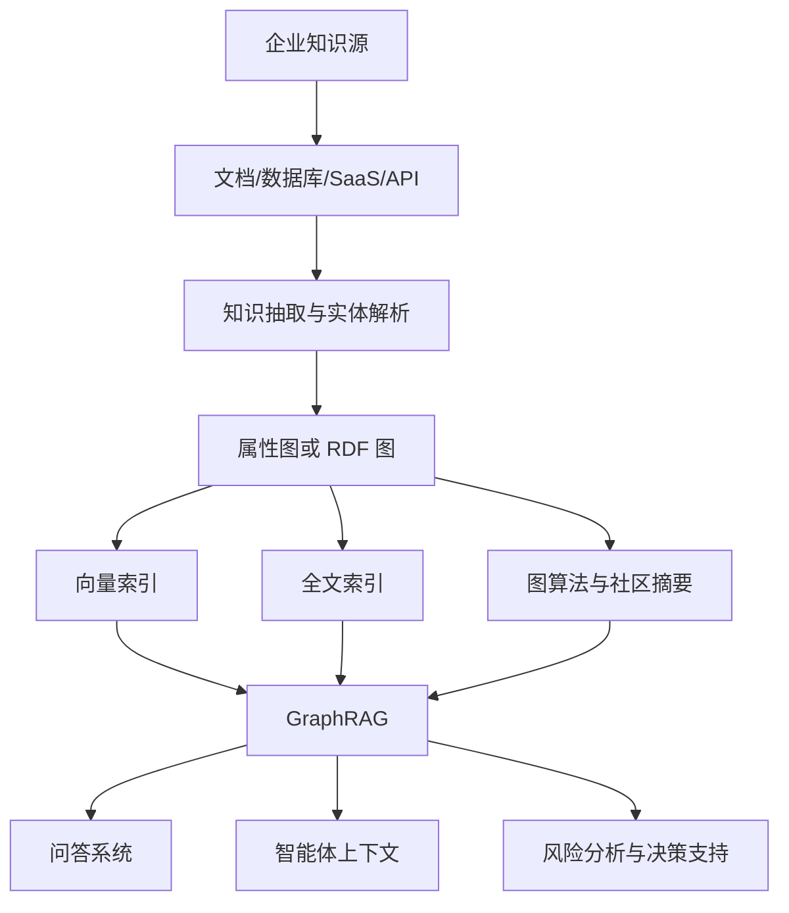

# 14 拓展：知识图谱最新进展与应用

## 引言

2024 到 2026 年，知识图谱重新变热，不是因为“图数据库”本身突然新了，而是因为 LLM 暴露了两个企业痛点：大模型需要可靠上下文，RAG 需要结构化关系。知识图谱正好补上“事实、关系、来源、权限、推理”这一层。

## 进展一：GraphRAG 从论文走向产品

Microsoft 的 GraphRAG 思路把文档先抽成实体图，再做社区检测和社区摘要，用于回答全局问题。Neo4j、AWS、TigerGraph 等产品线都开始把 GraphRAG 做成可用工具。

Neo4j 官方已经提供 `neo4j-graphrag` Python 包，支持知识图谱构建、向量检索、图检索和 GraphRAG 应用。AWS Bedrock Knowledge Bases 也支持结合 Neptune Analytics graph 的 GraphRAG，用图结构增强 RAG。TigerGraph 也在推进图与向量混合搜索。

## 代表路线对比

| 路线 | 核心思路 | 适合场景 | 不适合场景 |
|---|---|---|---|
| 向量增强问答 | 只检索相似文本片段 | 简单问答、FAQ、局部事实 | 多跳关系、全局总结、强溯源 |
| 局部图谱检索 | 从实体或 chunk 出发扩展邻居 | 关系链、影响分析、证据追踪 | 数据关系很稀疏或 schema 很乱 |
| 全局社区摘要 | 对社区生成摘要后检索 | “这批资料整体讲什么” | 需要最新细节、频繁增量更新 |
| 漂移搜索 | 同时利用全局主题和局部细节 | 大规模语料的综合问答 | 成本敏感、实时性极强场景 |
| 属性图索引 | 应用层抽取 chunk/entity/relation 并 upsert | 快速原型、应用内图谱 | 严格本体推理和跨系统语义标准 |

## 企业常用技术版图

| 能力层 | 关键技术 | 解决什么问题 | 企业常见要求 |
|---|---|---|---|
| 数据接入 | 连接器、ETL/ELT、CDC、对象存储扫描 | 把数据库、文档、SaaS、日志接入同一知识层 | 可重跑、可断点续跑、可追踪来源 |
| 知识抽取 | NER、关系抽取、LLM 结构化输出、函数调用 | 从文本中抽实体、关系、属性 | schema 约束、置信度、人工审核 |
| 实体解析 | 主数据管理、别名表、向量相似、编辑距离 | 合并同一对象的不同叫法 | 宁可漏合并，也要避免误合并 |
| 图存储 | Neo4j、Neptune、TigerGraph、GraphDB、Stardog | 承载属性图或 RDF 图 | 高并发查询、备份、权限、可观测 |
| 语义层 | 本体、SHACL、虚拟图、数据目录 | 统一业务概念和跨系统语义 | 版本管理、审批、血缘 |
| 图算法 | PageRank、WCC、Leiden、最短路径、相似度 | 找关键节点、社区、路径和异常 | 参数可解释、结果可回滚 |
| 检索层 | 向量检索、全文检索、Cypher/SPARQL、混合重排 | 支撑问答、搜索和智能体 | 延迟、准确率、引用来源 |
| 评估层 | golden set、事实一致性、引用覆盖率、人工反馈 | 判断图谱和问答是否可靠 | 持续评估、线上监控、告警 |
| 治理层 | 权限过滤、脱敏、审计日志、多租户 | 防止越权和泄露 | 继承源系统权限、可审计 |

## 代表方案如何定位

| 方案 | 当前定位 | 你应该学习什么 |
|---|---|---|
| Microsoft GraphRAG | 面向大规模文本语料的 local/global/DRIFT 检索框架 | 社区摘要、全局问答、局部细节和成本质量平衡 |
| Neo4j GraphRAG for Python | 官方 Python 包，覆盖 KG 构建、向量检索、图检索和 GraphRAG 管道 | 如何用 Neo4j + Python 把图谱能力接入应用 |
| Amazon Bedrock Knowledge Bases + Neptune Analytics | 托管式 GraphRAG，把 Bedrock 知识库和 Neptune 图分析结合 | 云上托管、企业集成、图结构增强 RAG |
| LlamaIndex PropertyGraphIndex | 在应用框架里构建属性图索引，可结合抽取器和向量存储 | 快速把文档节点、实体、关系组织成可检索图 |
| Stardog/Ontotext GraphDB | RDF、SPARQL、本体、推理、语义层和企业治理 | 标准语义网、跨系统语义统一和数据治理 |
| TigerGraph | 大规模并行图分析和企业图应用 | 高吞吐图计算、供应链/风控/推荐类大图场景 |

## 容易遗漏但很重要的新方向

**时序知识图谱**关注事实什么时候成立。例如“张三 2023 年属于 A 部门，2025 年属于 B 部门”。如果没有 `validFrom`、`validTo` 或事件节点，系统会把历史事实和当前事实混在一起。

**动态 GraphRAG**关注图谱变化后的局部更新。文档更新后，不应该全量重建所有社区摘要，而要识别受影响的 chunk、实体、关系和社区。

**Agent 记忆图谱**把用户、任务、工具、计划、结果组织成图。它比普通聊天记忆更适合回答“上次这个任务为什么失败”“某个工具影响哪些流程”这类关系问题。

**Graph + SQL + Vector 的统一检索**越来越常见。结构化指标用 SQL，语义相似用向量，实体关系用图查询，最后由路由器选择或组合。

**评估与可观测性**会成为企业能否上线的分水岭。只展示一张漂亮的图不够，还要知道实体准确率、关系准确率、引用覆盖率、无来源答案率、检索延迟和 token 成本。

## 近年时间线

- 2012：Google Knowledge Graph 让“things not strings”成为搜索和语义理解的标志性表达。
- 2024：Microsoft GraphRAG 推动 local/global search 和社区摘要路线进入主流讨论。
- 2024-2025：Neo4j、LlamaIndex、LangChain 等生态开始把图谱抽取、图检索、向量检索做成开发框架能力。
- 2025-2026：企业产品更关注动态更新、Agent 上下文、虚拟图、权限治理和成本控制，而不只是“能不能生成一张图”。

## 进展二：图谱成为 Agent 的上下文层

Agent 不只需要“记住文本”，还需要知道：

- 谁和谁有关？
- 哪个事实来自哪个系统？
- 某个操作会影响哪些对象？
- 哪些信息是最新的？

因此，企业开始把知识图谱作为 Agent 的 memory/context graph。图谱能给 Agent 提供可查询、可追踪、可治理的上下文。

## 进展三：虚拟图与零拷贝语义层

企业数据分散在数据库、数据仓库、湖仓、SaaS 和文档系统里。把所有数据搬进一个图数据库成本很高。

Stardog、Neo4j Virtual Graph 等方案强调“虚拟图”或“零拷贝”：让数据留在原系统，通过语义层把它映射成图来查询。这样可以减少迁移成本，也能继承原系统的权限和治理。

## 进展四：时间、增量与动态 GraphRAG

传统 GraphRAG 常把图谱当静态索引。但企业知识是变化的：合同更新、代码提交、客户状态变化、政策失效。

近期研究开始关注 temporal graph、incremental update、dynamic GraphRAG。核心问题是：图谱变化后，哪些实体、关系、社区摘要、向量索引需要更新？如果每次全量重建，成本和延迟都不可接受。

## 什么时候不该上图谱增强检索

不是所有场景都需要图谱：

- 文档很少、问题很简单，普通向量检索足够。
- 数据没有稳定实体，例如纯闲聊内容。
- 团队没有能力维护 schema、去重和权限，图谱会很快变脏。
- 对实时性要求极高，但图谱更新链路还没有增量能力。

判断标准很简单：如果问题经常涉及“谁和谁有关、经过几层关系、来源在哪里、整体主题是什么”，图谱值得考虑；如果只是找相似文本，先用普通检索。

## 典型应用

- 金融：公司、公告、交易、风险、实际控制人关系。
- 医疗：疾病、药物、症状、基因、临床试验关系。
- 制造：设备、零件、故障、工单、供应链关系。
- 软件工程：仓库、文件、函数、依赖、issue、PR 关系。
- 法务：合同主体、条款、义务、例外条件、时间范围。
- 企业知识库：文档、部门、产品、流程、客户问题。

## 小结

知识图谱的新趋势不是“图替代向量”，而是“图 + 向量 + 全文 + LLM + Agent”形成新的企业知识层。越是需要多跳、溯源、治理和实时更新的场景，知识图谱越有价值。

## 参考资料

- Microsoft GraphRAG：DRIFT Search、local/global search 与社区摘要方法。
- Neo4j GraphRAG for Python：知识图谱构建、向量检索、图检索和 GraphRAG 应用。
- Amazon Bedrock Knowledge Bases + Neptune Analytics：托管式 GraphRAG 与图/向量存储。
- LlamaIndex PropertyGraphIndex：应用层属性图索引、实体关系抽取与图谱查询。
