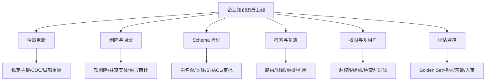

# 15 拓展：企业级知识图谱工程阻碍与成熟方案

## 引言

企业级知识图谱最难的地方不在“能不能抽出节点和边”，而在“能不能长期维护一个可信、可更新、可查询、成本可控的图谱”。这一课专门讨论真实阻碍点，以及外部成熟产品通常怎么处理。

## 阻碍一：增量更新

文档、数据库和业务事件每天都在变化。如果每次都全量重建图谱，成本很高，旧答案也可能和新数据冲突。

成熟做法：

- 使用稳定主键和 upsert。
- 保存 `updatedAt`、版本号和来源哈希。
- 只重算受影响的 chunk、实体、关系和社区摘要。
- 对时间敏感事实建立 temporal edges，例如 `validFrom`、`validTo`。

成熟系统通常会用内容哈希生成 chunk id，用任务状态记录 `processed_chunk` 和 `retry_condition`，并支持从上次位置继续。

## 阻碍二：删除与级联影响

删除一个文档不只是删一行数据。它可能影响 chunk、实体、关系、社区、索引、问答来源。

成熟做法：

- 区分“删除来源文档”和“删除实体事实”。
- 删除前检查实体是否被其他文档引用。
- 删除后清理孤立节点和无引用社区。
- 保留审计日志，避免误删不可恢复。

成熟系统会把删除设计成一组事务：删除 Document/Chunk，检查共享实体引用，清理孤立社区，刷新索引，并写入审计日志。

## 阻碍三：Schema 漂移

LLM 可能抽出 `Company`、`Organization`、`Org`、`Business`。如果不治理，图谱很快变成“同义词垃圾场”。

成熟做法：

- Schema-first 抽取。
- allowed nodes / allowed relationships。
- 定期 schema consolidation。
- 人工审批新增类型。
- 用本体或 SHACL/约束做质量检查。

成熟系统会把 `allowedNodes`、`allowedRelationship`、schema consolidation、人工审批和自动质量检查组合起来。

## 阻碍四：环与路径爆炸

用户提到“结构不能成环”。严格说，知识图谱不是不能成环，很多真实关系天然成环。例如 A 投资 B，B 合作 C，C 又收购 A。但工程上需要避免**无意义环**和**遍历爆炸**。

成熟做法：

- 给关系分类型，限制哪些关系可参与推理。
- 查询时限制 hop 数，例如 1..3 跳。
- 避免在 RAG 中无差别展开所有路径。
- 对高连接节点做降权，例如“美国”“公司”“产品”这类超级节点。
- 对层级关系保持 DAG 约束，例如组织层级、目录树、社区父子层级。

## 阻碍五：构建成本

LLM 抽取每个 chunk 都要花 token。大规模文档会让成本、延迟和失败率快速上升。

成熟做法：

- 先用规则或结构化字段确定 strong nodes。
- 只对高价值 chunk 做 LLM 抽取。
- 缓存抽取结果。
- 使用小模型/领域模型处理简单抽取，大模型处理复杂关系。
- 批处理和异步任务队列。

成熟系统会分批处理 chunk、记录 token usage、支持多模型 provider，并把低价值文本过滤在 LLM 调用之前。

## 阻碍六：检索策略选择

不是所有问题都适合 GraphRAG。简单问题用向量检索更快；结构化计数用 Cypher 更准；全局总结需要社区摘要。

成熟做法：

- 建立 query router。
- 同时支持 vector、fulltext、graph expansion、entity vector、community/global search、Text2Cypher。
- 记录每种模式的准确率、延迟和成本。

成熟系统通常会支持 `vector`、`fulltext`、`graph_vector`、`graph_vector_fulltext`、`entity_vector`、`global_vector`、`graph` 等多种 chat mode，并由 query router 自动选择。

## 阻碍八：数据血缘与可解释性

企业不会只问“答案是什么”，还会问“这条事实从哪里来、什么时候生成、由哪个模型抽取、有没有人工审核”。没有血缘，知识图谱很难进入风控、法务、金融、医疗等严肃场景。

成熟做法：

- 每个实体、关系和属性都保留来源文档、chunk、抽取模型、抽取时间和置信度。
- 对人工编辑、自动合并、删除和回滚写审计日志。
- 回答时返回引用来源，而不是只返回自然语言结论。
- 对关键事实使用“事实节点”或 reification，把来源、时间和置信度挂在事实本身。

## 阻碍九：实体解析与主数据冲突

实体解析是企业知识图谱的硬仗。`Apple` 可能是公司、水果、唱片公司；`ABC Ltd.` 可能对应多个国家的法人主体。误合并会污染整张图。

成熟做法：

- 优先接入主数据管理系统，使用客户号、供应商号、统一社会信用代码等强主键。
- 弱匹配只给候选，不自动合并高风险实体。
- 合并前检查 label、国家、时间范围、上下文和来源。
- 保留 merge history，支持拆分和回滚。

## 阻碍十：评估与线上监控

很多图谱 demo 看起来能回答，但上线后不知道错在哪里。企业需要持续评估，而不是上线前测一次。

成熟做法：

- 建立 golden set：实体抽取样本、关系抽取样本、多跳问答样本、权限样本。
- 记录检索链路：命中了哪些 chunk、走了几跳、用了哪些社区摘要。
- 监控重复实体率、孤立节点率、schema drift、无来源答案率、平均跳数、查询延迟和 token 成本。
- 对高风险回答做人审，持续把反馈写回评估集。

## 阻碍十一：多租户与权限继承

企业知识图谱常常服务多个部门、客户或产品线。不同租户之间不能互相看到数据，同一租户内部也有角色权限。

成熟做法：

- 节点、关系、chunk 都带 tenant id 和权限标签。
- 检索前过滤，不是在答案生成后再过滤。
- 社区摘要也要按权限生成或过滤，否则摘要可能泄露无权限信息。
- 对管理员、普通用户、外部客户使用不同图谱视图。

## 阻碍十二：多跳查询与路径爆炸

多跳是知识图谱的优势，也是工程风险。一个高连接节点可能让 3 跳查询返回成千上万条路径。

成熟做法：

- 限制跳数和关系类型，例如只允许 `MENTIONS|DEPENDS_ON|OWNS` 参与某类问题。
- 对超级节点降权或过滤，例如“公司”“系统”“美国”这类泛化节点。
- 对路径做重排：短路径、强来源、高置信度、权限可见优先。
- 对 Text2Cypher 生成的查询做安全检查，禁止无限路径和危险写操作。

## 阻碍七：权限与治理

企业图谱可能连接客户、合同、财务、人事数据。GraphRAG 一旦跨越权限边界，就会把敏感上下文交给 LLM。

成熟做法：

- 保留数据源权限。
- 查询前做访问控制过滤。
- 对不同用户生成不同可见子图。
- 对 LLM 上下文做脱敏。
- 记录查询审计。

Stardog、Neo4j Virtual Graph 等虚拟图方案的价值之一，就是让数据留在原系统，尽量继承原有治理控制。

## 企业级产品与方案对照

| 产品/方案 | 主要特点 | 适合解决的问题 |
|---|---|---|
| Neo4j | 属性图、Cypher、GDS、GraphRAG Python、可视化生态 | 工程图谱、路径查询、GraphRAG、图算法 |
| Amazon Neptune + Bedrock | 托管图数据库/图分析，与 Bedrock Knowledge Bases 结合 | 云上 RAG、托管运维、AWS 生态集成 |
| Stardog | 企业知识图谱、虚拟图、语义层、推理和治理 | 多源数据统一、零拷贝语义层、Agent 上下文 |
| Ontotext GraphDB | RDF/SPARQL、语义搜索、企业知识图谱治理 | 标准语义网、本体、语义数据管理 |
| TigerGraph | 大规模并行图数据库、GraphRAG/混合搜索方向 | 大图分析、高吞吐图查询、企业 AI 图基础设施 |

## 企业级验收清单

上线前至少检查：

| 维度 | 检查项 |
|---|---|
| 数据权限 | chunk、document、entity 是否带权限字段；检索前是否过滤无权限来源 |
| 审计日志 | 谁触发了抽取、删除、合并、社区重算；是否能追踪 |
| 删除恢复 | 是否支持软删除、误删回滚、共享实体保护 |
| Schema 变更 | 新增 label/relationship 是否审批；旧关系如何迁移 |
| 评估集 | 是否有实体、关系、问答、引用来源的人工标注样本 |
| 服务指标 | 平均延迟、失败率、token 成本、索引刷新时间是否有阈值 |
| 重试策略 | LLM 超时、数据库死锁、任务取消后是否能从断点恢复 |
| 监控指标 | 重复实体率、孤立节点率、schema drift、无来源答案率是否可见 |

## 企业级成熟方案模式

| 阻碍 | 成熟方案 | 代表产品/生态能力 |
|---|---|---|
| 多源数据接入 | 连接器、CDC、虚拟图、数据目录 | Stardog Virtual Graph、Neo4j、Neptune、数据集成平台 |
| Schema 漂移 | 本体治理、SHACL、白名单抽取、审批流 | Ontotext GraphDB、Stardog、RDF/OWL 生态、Neo4j 约束 |
| 大规模图查询 | 图数据库分区、索引、查询计划、图分析引擎 | Neo4j、TigerGraph、Neptune Analytics |
| GraphRAG 问答 | 向量 + 全文 + 图扩展 + 社区摘要 | Microsoft GraphRAG、Neo4j GraphRAG、Bedrock + Neptune |
| 权限治理 | 源权限继承、检索前过滤、脱敏、审计 | 企业 IAM、数据目录、虚拟图、私有化部署 |
| 评估监控 | Golden set、链路日志、成本与质量指标 | RAG 评估框架、LLM Observability、内部标注平台 |
| 回滚与人审 | 变更日志、版本图谱、人工审批队列 | 工作流系统、审计系统、数据治理平台 |

## 复盘问题

- 如果一个文档更新了，哪些节点和索引必须重新计算？
- 如果误合并了两个实体，系统如何回滚？
- 如果用户没有某个文档权限，GraphRAG 如何避免把该文档 chunk 放进上下文？

## 小结

企业级知识图谱不是“把 Neo4j 跑起来”就完成了。真正的挑战是增量、删除、schema、成本、检索、权限、评估和治理。成熟方案通常不是单点工具，而是一套图数据库、语义层、索引、任务系统、评估系统和权限系统的组合。

## 参考资料

- Microsoft GraphRAG：local search、global search、DRIFT Search。
- Neo4j GraphRAG for Python 与 Neo4j Python Driver：图谱构建、检索器、Text2Cypher、向量索引。
- Amazon Bedrock Knowledge Bases with Neptune Analytics：企业托管式 GraphRAG 构建和增量同步。
- LlamaIndex PropertyGraphIndex：属性图构建、检索与查询引擎。
